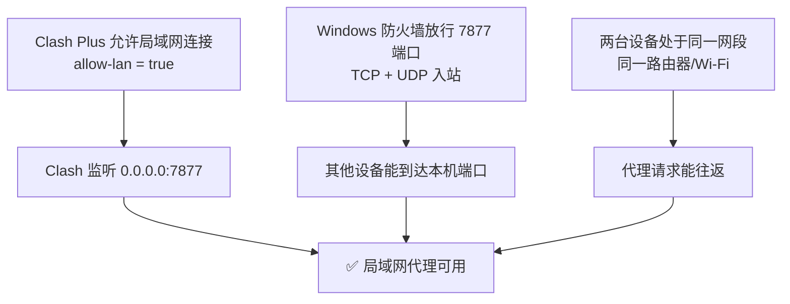

# Clash Plus 局域网代理配置教程

> 适用场景：让同一局域网内的其他设备（手机、平板、电脑）通过本机 Clash Plus 的代理上网。
> 已验证环境：Windows + Clash Plus（MyClash 内核），代理端口 7877。
> 官方下载地址：<https://clashplus.io>

---

## 一、原理说明

Clash 默认**只监听本机回环地址 `127.0.0.1`**，所以其他设备用 `局域网IP:7877` 连不上。要让局域网设备能连，必须满足三个条件：



**三个条件缺一不可**，任何一个不满足都会导致"IP+端口连不上"。

---

## 二、前置条件

| 项目 | 要求 |
|------|------|
| 本机 | Windows + 已安装 Clash Plus |
| 代理端口 | 记为 `7877`（可在设置中修改，范围 1-65535） |
| 网络 | 本机与其他设备连接**同一个路由器/Wi-Fi** |
| 权限 | 修改防火墙需要管理员权限 |

---

## 三、配置步骤

### 步骤 1：开启 Clash 的局域网监听（allow-lan）

1. **退出 Clash Plus**：右键托盘图标 → 退出，确认进程完全关闭（修改前必须退出，否则配置会被覆盖）。
2. 打开配置文件：
   `C:\Users\Administrator\AppData\Roaming\Clash Plus\Clash Plus\shared_preferences.json`
   > 建议先复制一份备份，例如 `shared_preferences.json.bak`。
3. 用记事本 / VS Code 打开，找到 `patchClashConfig` 中的：

   ```json
   "allow-lan": false
   ```

   改为：

   ```json
   "allow-lan": true
   ```

4. 保存文件，重新启动 Clash Plus。

> **说明**：`allow-lan: true` 会让 Clash 监听所有网卡（`0.0.0.0`），而非仅本机回环。部分 Clash 客户端界面有「允许局域网连接 / Allow LAN」开关，效果相同。

### 步骤 2：Windows 防火墙放行端口

以**管理员身份**打开 PowerShell，执行：

```powershell
New-NetFirewallRule -DisplayName "Clash Plus 7877 TCP" -Direction Inbound -LocalPort 7877 -Protocol TCP -Action Allow
New-NetFirewallRule -DisplayName "Clash Plus 7877 UDP" -Direction Inbound -LocalPort 7877 -Protocol UDP -Action Allow
```

验证是否生效：

```powershell
Get-NetFirewallRule -DisplayName "Clash Plus 7877*" | Select-Object DisplayName, Enabled, Direction, Action
```

> 也可走图形界面：Windows 安全中心 → 防火墙和网络保护 → 高级设置 → 入站规则 → 新建规则 → 端口 → 7877（TCP + UDP）→ 允许连接。

### 步骤 3：查询本机局域网 IP

```powershell
ipconfig
```

找到**当前上网的网卡**（无线 WLAN 或以太网）下的 IPv4 地址，通常是 `192.168.x.x` 或 `10.x.x.x`，记下来。本机示例：`192.168.1.12`。

> 注意：**不是** `127.0.0.1`，那是本机回环地址，其他设备访问不到。

### 步骤 4：其他设备配置代理

以端口 `7877`、本机 IP `192.168.1.12` 为例：

| 设备 | 操作路径 | 填写内容 |
|------|----------|----------|
| Windows | 设置 → 网络和 Internet → 代理 → 手动代理 | 地址 `192.168.1.12`，端口 `7877`，协议 HTTP |
| Android | Wi-Fi 长按 → 修改网络 → 高级选项 → 代理 | 主机名 `192.168.1.12`，端口 `7877` |
| iOS / macOS | Wi-Fi 设置 → 配置代理 → 手动 | 服务器 `192.168.1.12`，端口 `7877` |
| 浏览器插件（SwitchyOmega 等） | 代理服务器 | 协议 HTTP，地址 `192.168.1.12`，端口 `7877` |

---

## 四、验证连通性

**方法一：命令验证（本机测试端口是否对外开放）**

```powershell
Test-NetConnection 192.168.1.12 -Port 7877
```

`TcpTestSucceeded : True` 表示端口可达。

**方法二：客户端验证（其他设备上操作）**

在手机 / 其他电脑配置好代理后，浏览器打开 `https://www.google.com` 或访问 `https://api.ipify.org`，能看到能正常打开 / 显示代理出口 IP，即成功。

---

## 五、常见问题排查

| 现象 | 可能原因 | 解决办法 |
|------|----------|----------|
| 连不上，`TcpTestSucceeded : False` | ① allow-lan 未开启 | 检查 `shared_preferences.json` 是否 `"allow-lan": true`，重启 Clash |
| | ② 防火墙未放行 | 重新执行步骤 2，确认规则 `Enabled=True` |
| | ③ 端口被占用 / 改了端口 | 确认 Clash 设置里端口号，客户端填写一致 |
| 配置正确但手机还是上不了网 | 两台设备不在同一网段 | 确认连接同一个路由器 / Wi-Fi |
| | 路由器开启 **AP 隔离**（常见于访客网络） | 换用主网络，或关闭 AP 隔离 |
| | 手机开了 VPN / 其他代理 | 关闭后再试 |
| 部分网站能开、部分打不开 | Clash 规则模式（rule）按规则分流 | 属正常现象，可切换「全局模式」测试 |
| 重启 Clash 后配置被还原 | 修改时 Clash 未完全退出 | 从托盘彻底退出后再改，改完再启动 |

---

## 六、关键文件路径速查

| 内容 | 路径 |
|------|------|
| 程序目录 | `D:\Program Files\Clash Plus\` |
| 配置目录 | `C:\Users\Administrator\AppData\Roaming\Clash Plus\Clash Plus\` |
| 运行时配置 | `...\Clash Plus\config.yaml`（UI 生成，勿手改） |
| UI 持久化配置 | `...\Clash Plus\shared_preferences.json`（改这里） |
| 配置备份 | `...\Clash Plus\shared_preferences.json.bak` |

---

*教程基于 2026-09-06 实际验证流程整理。*
