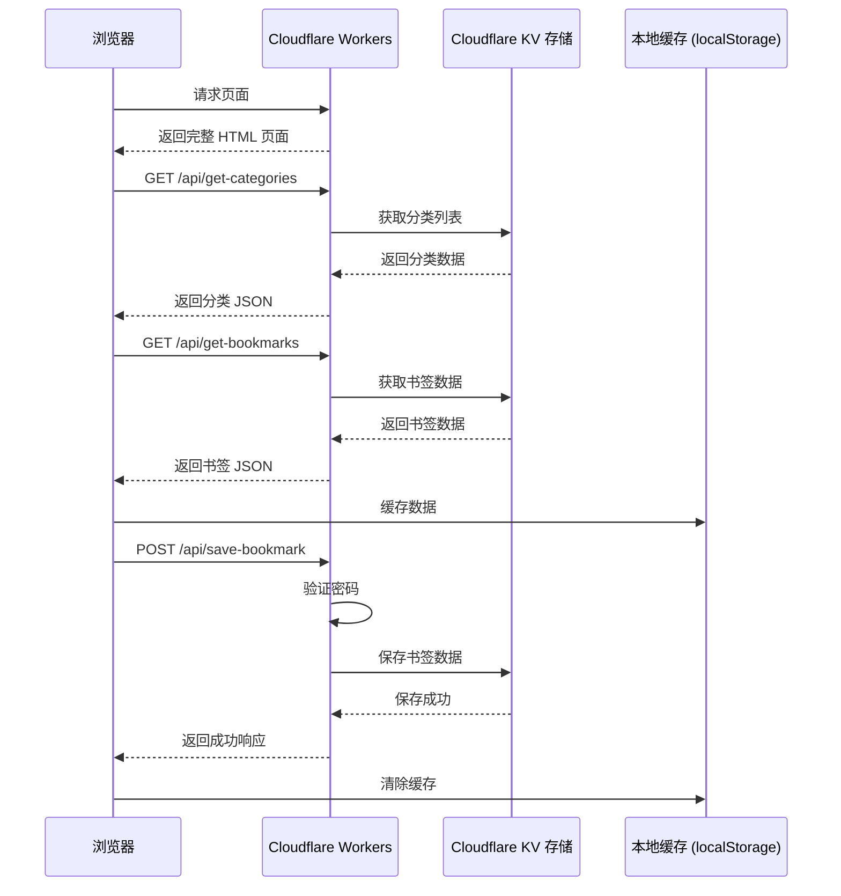

# Cloudflare Workers 导航页应用开发方案

## 1. 项目概述

本项目是一个基于 Cloudflare Workers 和 KV 存储的无服务端导航页应用，用于个人常用网址的管理和快速访问。

### 核心功能
- ✅ 书签管理（添加、编辑、删除）
- ✅ 分类管理（自动创建分类、分类筛选）
- ✅ 深色/浅色模式切换
- ✅ 操作密码验证
- ✅ 本地缓存优化
- ✅ 响应式设计（支持移动端和桌面端）

### 技术栈
- **前端**：HTML5 + Tailwind CSS + Font Awesome
- **后端**：Cloudflare Workers
- **存储**：Cloudflare Workers KV
- **部署**：Cloudflare Workers 平台

## 2. 技术架构

### 2.1 整体架构



### 2.2 目录结构

```
/
├── worker_home.js       # 主应用文件（包含前后端逻辑）
└── readme_home.md       # 开发文档
```

## 3. 代码结构分析

### 3.1 后端 API 模块

| 接口路径 | 方法 | 功能描述 | 权限验证 |
|---------|------|----------|----------|
| `/api/get-categories` | GET | 获取所有分类 | 无需验证 |
| `/api/get-bookmarks` | GET | 获取书签（支持分类筛选） | 无需验证 |
| `/api/save-bookmark` | POST | 保存/更新书签 | 需要密码验证 |
| `/api/delete-bookmark` | POST | 删除书签 | 需要密码验证 |

### 3.2 前端模块

| 模块名称 | 功能描述 | 实现文件 |
|---------|----------|----------|
| 页面渲染 | 生成书签卡片和分类标签 | worker_home.js (前端部分) |
| 主题切换 | 深色/浅色模式切换 | worker_home.js (前端部分) |
| 表单处理 | 书签添加/编辑表单 | worker_home.js (前端部分) |
| 缓存管理 | 本地数据缓存 | worker_home.js (前端部分) |
| 分类管理 | 分类下拉选择 | worker_home.js (前端部分) |

## 4. 核心功能模块

### 4.1 书签管理模块

**功能点**：
- 添加新书签（支持指定分类）
- 编辑现有书签（支持修改分类）
- 删除书签（需要密码验证）
- 按分类筛选书签

**实现细节**：
- 使用 Cloudflare KV 存储书签数据
- 每个分类对应一个 KV 键值对
- 分类列表单独存储在 `bookmarks:categories` 键中
- 编辑书签时支持跨分类移动（先删除旧分类中的书签，再添加到新分类）

### 4.2 分类管理模块

**功能点**：
- 自动创建新分类
- 分类列表排序
- 分类下拉选择
- 空分类自动清理

**实现细节**：
- 当添加新书签时，如果指定的分类不存在，则自动创建
- 分类列表使用 `Set` 去重并排序
- 当删除分类下最后一个书签时，自动从分类列表中移除该分类
- 前端实现分类下拉搜索功能，支持模糊匹配

### 4.3 安全验证模块

**功能点**：
- 操作密码验证
- 密码错误提示

**实现细节**：
- 所有写操作（添加、编辑、删除）都需要密码验证
- 密码通过环境变量 `BOOKMARK_PASSWORD` 配置，默认值为 `default123`
- 验证失败时返回 403 状态码和错误信息

### 4.4 性能优化模块

**功能点**：
- 本地缓存
- 缓存过期机制
- 网络请求失败降级

**实现细节**：
- 使用 `localStorage` 缓存书签数据，缓存时间为 5 分钟
- 缓存键格式：`bookmarks_{category}` 和 `bookmarks_{category}_timestamp`
- 网络请求失败时，尝试使用缓存数据
- 数据更新后自动清除相关缓存

### 4.5 界面模块

**功能点**：
- 响应式设计
- 深色/浅色模式
- 玻璃态效果
- 交互动画

**实现细节**：
- 使用 Tailwind CSS 的响应式类
- 深色模式通过 `dark:` 类实现
- 玻璃态效果使用 `backdrop-filter` CSS 属性
- 卡片悬停效果和发光动画
- 主题偏好通过 `localStorage` 持久化

## 5. 数据模型

### 5.1 KV 存储结构

| 键名 | 值类型 | 描述 |
|------|--------|------|
| `bookmarks:categories` | JSON 数组 | 所有分类列表 |
| `bookmarks:{category}` | JSON 数组 | 对应分类下的书签列表 |

### 5.2 书签数据结构

```javascript
{
  "name": "网站名称",  // 字符串，书签名称
  "url": "https://example.com"  // 字符串，网站地址
}
```

### 5.3 本地缓存结构

| 键名 | 值类型 | 描述 |
|------|--------|------|
| `bookmarks_all` | JSON 数组 | 所有书签的缓存 |
| `bookmarks_all_timestamp` | 字符串 | 缓存时间戳 |
| `bookmarks_{category}` | JSON 数组 | 对应分类书签的缓存 |
| `bookmarks_{category}_timestamp` | 字符串 | 分类缓存时间戳 |
| `bookmarks_categories` | JSON 数组 | 分类列表的备份 |
| `theme` | 字符串 | 主题偏好（light/dark） |

## 6. API 接口说明

### 6.1 GET /api/get-categories

**功能**：获取所有分类列表

**请求参数**：无

**响应**：
```json
["工具类", "编程类", "影音类"]
```

### 6.2 GET /api/get-bookmarks

**功能**：获取书签列表，支持分类筛选

**请求参数**：
- `category` (可选)：分类名称，不传递或为 `all` 时返回所有分类的书签

**响应**：
```json
[
  {"name": "GitHub", "url": "https://github.com", "category": "编程类"},
  {"name": "百度", "url": "https://www.baidu.com", "category": "工具类"}
]
```

### 6.3 POST /api/save-bookmark

**功能**：保存或更新书签

**请求体**：
```json
{
  "name": "网站名称",
  "url": "https://example.com",
  "category": "分类名称",
  "password": "操作密码",
  "isEditing": false,
  "originalName": "",
  "originalUrl": ""
}
```

**响应**：
```json
{"success": true}
```

### 6.4 POST /api/delete-bookmark

**功能**：删除书签

**请求体**：
```json
{
  "name": "网站名称",
  "url": "https://example.com",
  "category": "分类名称",
  "password": "操作密码"
}
```

**响应**：
```json
{"success": true}
```

## 7. 部署说明

### 7.1 前置条件

1. **Cloudflare 账号**：需要一个 Cloudflare 账号
2. **Workers 订阅**：确保账号有 Workers 访问权限
3. **KV 命名空间**：创建一个 KV 命名空间用于存储书签数据

### 7.2 环境配置

1. **创建 KV 命名空间**：
   - 名称：建议使用 `BOOKMARKS_KV`
   - 绑定：在 Workers 配置中绑定为 `BOOKMARKS_KV`

2. **配置环境变量**：
   - `BOOKMARK_PASSWORD`：操作密码，建议设置强密码

### 7.3 部署步骤

1. **使用 Wrangler CLI**：
   ```bash
   # 安装 Wrangler
   npm install -g wrangler
   
   # 初始化项目
   wrangler init bookmark-app
   
   # 复制代码到 index.js
   # 配置 wrangler.toml
   
   # 部署
   wrangler deploy
   ```

2. **wrangler.toml 配置示例**：
   ```toml
   name = "bookmark-app"
   main = "index.js"
   compatibility_date = "2024-01-01"
   
   [[kv_namespaces]]
   binding = "BOOKMARKS_KV"
   id = "<YOUR_KV_NAMESPACE_ID>"
   
   [vars]
   BOOKMARK_PASSWORD = "<YOUR_PASSWORD>"
   ```

## 8. 维护指南

### 8.1 日常维护

1. **密码管理**：定期更新 `BOOKMARK_PASSWORD` 环境变量
2. **数据备份**：定期导出 KV 数据作为备份
3. **性能监控**：关注 Workers 的请求数和执行时间
4. **缓存管理**：如果遇到数据不同步问题，可指导用户清除浏览器缓存

### 8.2 常见问题排查

| 问题 | 可能原因 | 解决方案 |
|------|----------|----------|
| 书签不显示 | 网络请求失败 | 检查网络连接，尝试刷新页面 |
| 操作失败 | 密码错误 | 确认操作密码是否正确 |
| 数据不同步 | 缓存过期 | 清除浏览器本地存储缓存 |
| 分类丢失 | KV 存储问题 | 检查 KV 命名空间配置 |

### 8.3 日志和监控

- **Cloudflare Dashboard**：查看 Workers 的请求日志和错误信息
- **KV 存储监控**：监控 KV 操作的频率和延迟
- **前端控制台**：使用浏览器开发者工具查看前端错误

## 9. 扩展建议

### 9.1 功能扩展

1. **多用户支持**：
   - 添加用户认证系统
   - 为每个用户创建独立的书签空间

2. **导入/导出**：
   - 支持从浏览器书签导出导入
   - 支持 JSON 格式备份

3. **搜索功能**：
   - 添加书签搜索功能
   - 支持关键词高亮

4. **标签系统**：
   - 为书签添加多个标签
   - 支持按标签筛选

5. **访问统计**：
   - 记录书签访问次数
   - 按访问频率排序

### 9.2 技术升级

1. **存储方案**：
   - 考虑使用 Cloudflare D1 数据库存储结构化数据
   - 对于大型附件，可使用 Cloudflare R2

2. **前端框架**：
   - 迁移到 React 或 Vue 等现代前端框架
   - 使用 Vite 构建工具

3. **后端优化**：
   - 拆分前端和后端代码
   - 使用 Pages Functions 替代单一 Worker 文件

4. **CI/CD**：
   - 配置 GitHub Actions 自动部署
   - 添加代码质量检查

## 10. 代码优化建议

### 10.1 代码结构优化

1. **模块化拆分**：
   - 将前端和后端代码分离
   - 按功能模块拆分代码

2. **错误处理**：
   - 增强错误处理机制
   - 添加详细的错误日志

3. **代码风格**：
   - 使用 ESLint 规范代码风格
   - 添加 JSDoc 注释

### 10.2 性能优化

1. **缓存策略**：
   - 优化缓存过期时间
   - 实现增量更新

2. **网络请求**：
   - 使用 HTTP/2 多路复用
   - 实现请求防抖

3. **前端渲染**：
   - 优化 DOM 操作
   - 使用虚拟列表处理大量书签

### 10.3 安全性

1. **密码安全**：
   - 考虑使用更安全的认证方式
   - 实现密码强度检测

2. **输入验证**：
   - 增强前端输入验证
   - 实现后端输入校验

3. **CORS 配置**：
   - 优化 CORS 策略
   - 考虑使用 Cloudflare Access

## 11. 版本控制

| 版本 | 日期 | 变更内容 |
|------|------|----------|
| v1.0 | 2024-01-01 | 初始版本，实现基本书签管理功能 |
| v1.1 | 2024-01-15 | 添加分类管理和主题切换功能 |
| v1.2 | 2024-02-01 | 优化本地缓存和响应式设计 |
| v1.3 | 2024-02-15 | 增强安全验证和错误处理 |

## 12. 总结

本项目是一个功能完整、性能优化的 Cloudflare Workers 导航页应用，通过 KV 存储实现了无服务端的书签管理功能。代码结构清晰，功能模块化，便于后续维护和扩展。

通过本开发方案文档，开发者可以快速理解项目架构和代码逻辑，为后续的功能扩展和问题排查提供参考。建议定期更新文档以反映代码的变更和新功能的添加。

---

**维护注意事项**：
- 定期检查 Cloudflare Workers 的使用配额
- 注意 KV 存储的读取/写入限制
- 保持密码的安全性
- 关注 Cloudflare 平台的更新和新特性

**联系方式**：
- 如有任何问题或建议，请联系项目维护者
- 建议在代码仓库中添加 ISSUE 模板，便于问题跟踪